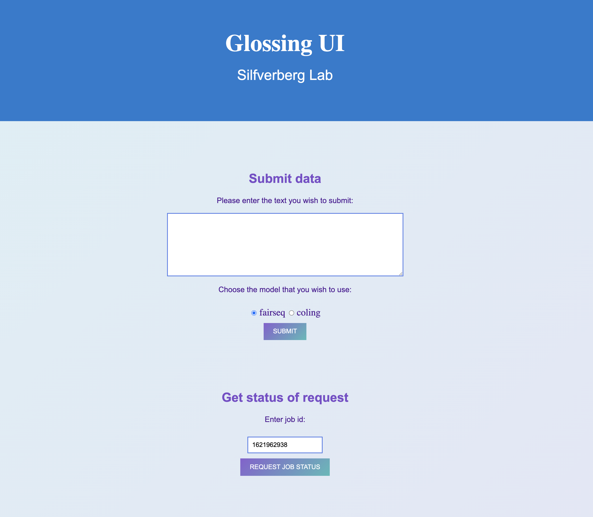
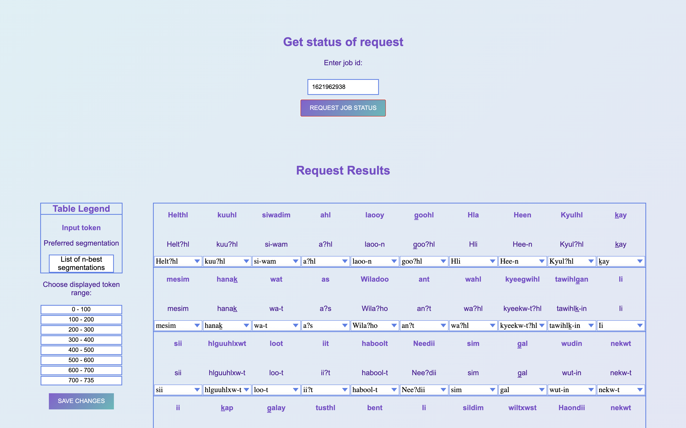

# What is it? 

Glossing UI is a web application that provides a simple and efficient user interface for submitting Gitksan text for processing by nerual language models and obtain segmentation results for each toekn. The interface provides a simple way to access, process and save the results.

The following are features that are currently supported:
* get job status using job id
* access the results using the results table
* for each token in the resultant token list it is possible to choose the preferred segmentation
* it is possible to add a custom preferredsegmentaiton for each token in the result
* after processing, the results are saved on the server and the users can come back and continue processing the reuslts

### Implemented with:
* Models and server run in Docker containers
* Server was implemented using Python-based Flask framework
* HTML5/JavaScript/CSS front end

## Screenshots
### The main screen where users can submit their jobs and choose a model. 

### After job is submitted and the request is processed, the users can access the results in the form of the results table below. 
The users can choose a page of results on the left panel. The legend of the table is also displayed on theleft panel. Each cell in the table contaains the input token, its preferred segmentation and a list of n-best segmentations from which users can choose.
